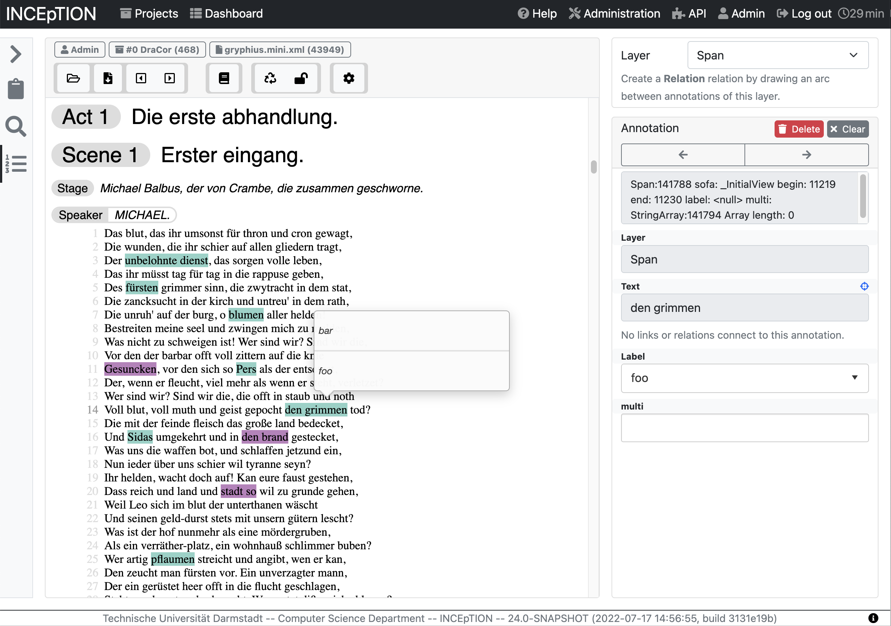

# INCEpTION AnnotatorJS Editor Plugin

**Note: This is an early access repository. The way that things work will likely be subject to regular changes for the time being.** 



This repository is an example based on the [AnnotatorJS](http://annotatorjs.org) JavaScript editor component of how to integrate a JavaScript-based annotation editor with INCEpTION. The original AnnotatorJS was written in CoffeeScript. This repository does not contain the original version, but
rather a conversion of the AnnotatorJS v1.2.10 to TypeScript that was also stripped down to only the parts needed for this editor.

Starting with INCEpTION v23, external editor plugins are supported. To use this editor, first create a folder named `editors` in your INCEpTION application home. By default, this is `~/.inception`, but on server installations, you will usually have set it to something else such as `/srv/inception`.

Clone this repository as a sub-folder under the `editors` folder.

tl;dr: 

```
$ cd ~/.inception
$ mkdir editors
$ cd editors
$ git clone https://github.com/inception-project/inception-annotatorjs-editor-plugin.git
```

Finally, start INCEpTION. Early during start-up, you should see a message like this:

```
ExternalEditorLoader - Loading editor plugin: AnnotatorJS (external)
```

Also, on the annotation page, you should be able to switch to that editor.

If a document was imported as a HTML file, the editor should display the HTML layout of the file.

## TEI support

This editor includes an experimental stylesheet for TEI files from the [DraCor](https://dracor.org)
project. Import them as `XML (generic)` into a project and try opening them with this editor.
